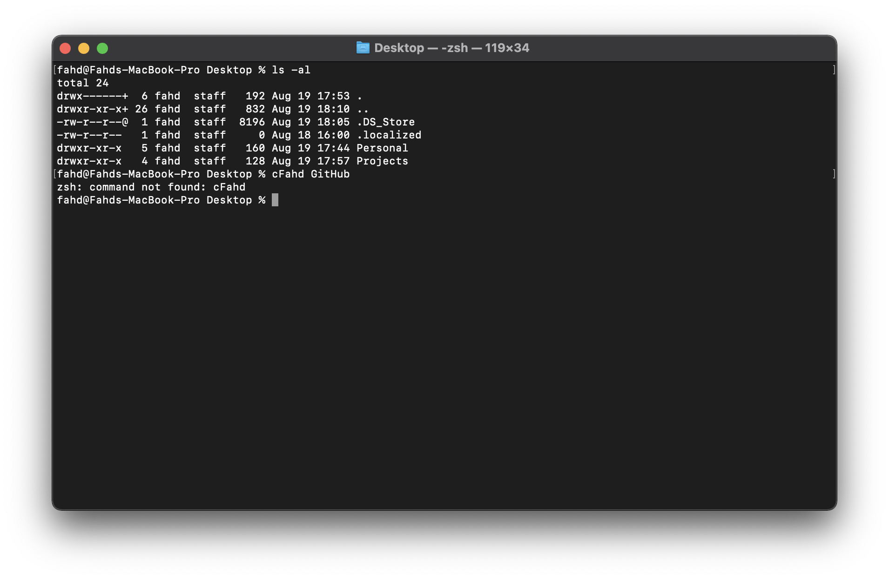
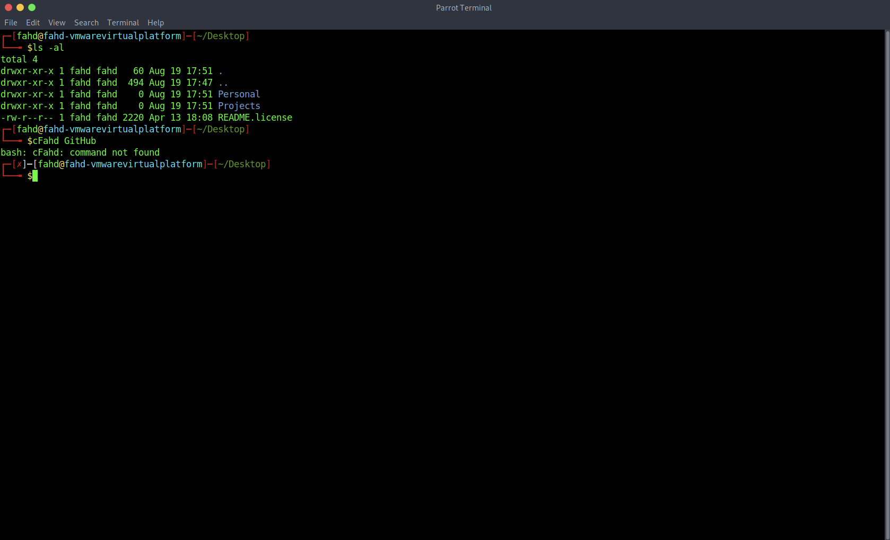
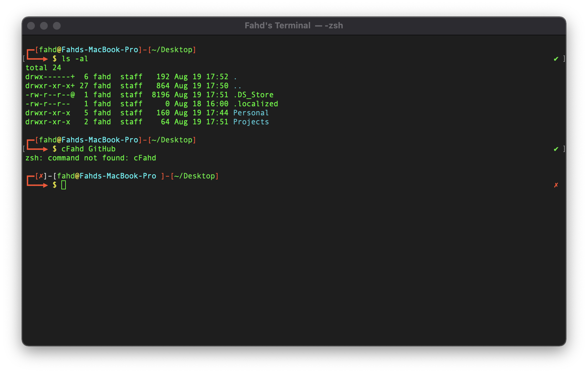

# MacOS zsh Parrot OS Terminal Theme

Custom theme developed for Parrot OS enthusiasts looking to give their MacOS terminal a similar look and feel.

* Below is the default MacOS terminal shell.


* Below is the Linux Parrot OS terminal shell.



* Below MacOS terminal shell with the custom Parrot OS terminal theme.


## Description
The code provided is a zsh resource file code that allows for a custom Parrot OS theme to be applied at the startup of the macOS terminal shell. It is intended to best resemble Parrot OS through its terminal colours & overall look. Overall, a great theme for those who have worked on Parrot OS and would like the theme on their macintosh! 
## Getting Started

### Dependencies

1. Make sure your terminal is using zsh! To check use the command below.```echo $SHELL```
2. If your terminal returns ```/bin/zsh``` then you are using zsh and can skip the next command.
3. Next is the command if your terminal is not running zsh.```chsh -s /bin/zsh```
4. You can run the first step again to check if your shell by default is zsh.

### Installing
1. Open your terminal on macOS and type the following command if you do not already have a zsh resource file ```touch ~/.zshrc```
2. Now that you have created the resoruce file, lets open the file. You can use vim or nano etc, but lets open it on our mac.
3. To open the file on our mac, enter the following command. ```open ~/.zshrc``` this will open the file in our default texteditor.
4. Copy the code from this GitHub page in the file ```cfahd.txt``` and paste it into the ```.zshrc``` file. Be sure to save your file and exit.
5. Run the following command ```source ~/.zshrc; clear``` in your terminal to have the Parrot OS theme!

## Authors

Contributors names and contact info

Developer: [@cFahd](https://github.com/cfahd/)

## Version History
* 0.1
    * Initial Release

## License

This project is licensed under the cFahd License - see the LICENSE.md file for details

